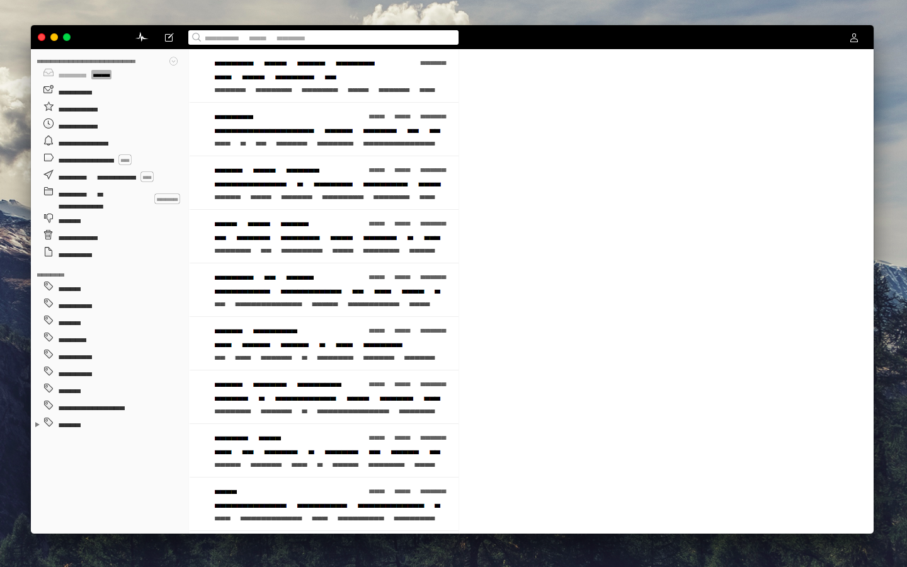
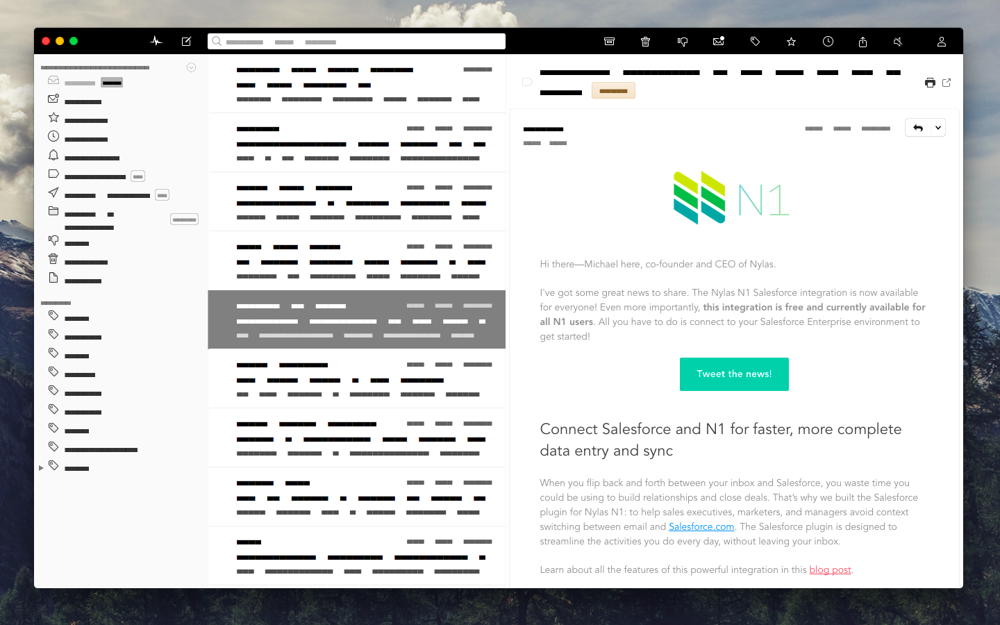
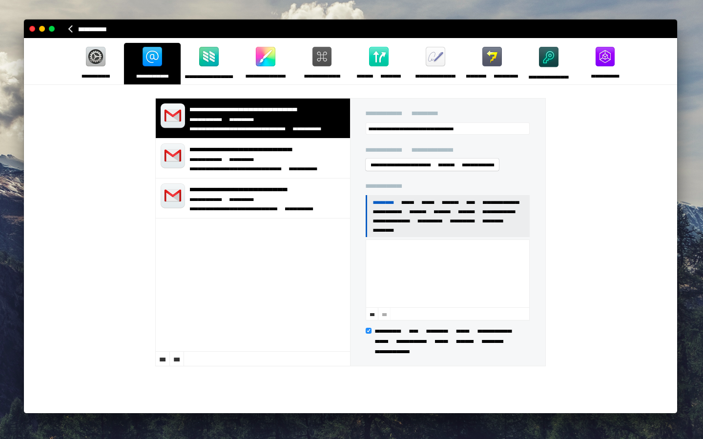
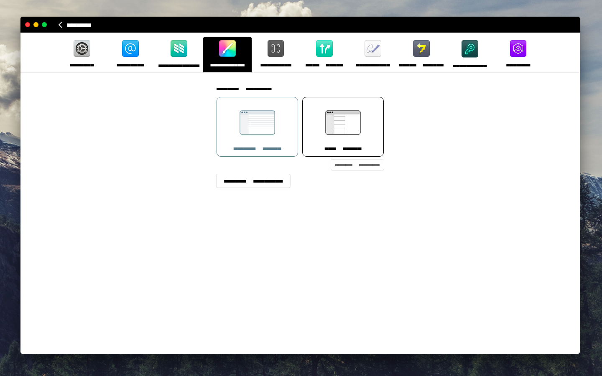

# N1-MDL
Theme based on **Google [MDL Palette][1]** for [Nylas][nylas] [N1][n1] mail client.

### Settings
- #### General

- #### Accounts

- #### Themes

> Transition smoothed
**More color combinations [here](https://github.com/Rawnly/n1-mdl/blob/master/docs/list.md).**

# How to:
## Install
1. [Download](https://nylas.com/n1) Nylas N1 email client if you have not yet
2. [Just download the latest release](https://github.com/Rawnly/n1-mdl/releases) ( clean installation ) or clone [this repo](https://github.com/Rawnly/n1-mdl/)
3. Open `N1>Preferences>General>Select theme` and select `Install new theme...` from the dropdown

## <u>Make</u> it yours!
The theme is based on 2 color variables `@primary` and `@secondary`. Edit them it's simple, just open this `~/.nylas/packages/n1-mdl/styles/user/user-colors.less` at [this line](http://github.com/Rawnly/n1-mdl/blob/master/styles/user.less#L3).

You can grab colors from [`colors.less`](http://github.com/Rawnly/n1-mdl/blob/master/styles/theme-colors.less) in the same folder.

### Colors Preview
For a live preview you can use [this tool][2] by Google.
 or [unofficlial](http://rawnly.github.io/n1-mdl/tool/index.html) tool edited by me

**Reccomandation**: `-A` means 'accent'. Then for a better result use accents only for _secondary_ colors not as _primary_ color (**[Material Design Guidelines][1]** ).

#### Colors List:
- red ( @red & @red-a )    
- pink ( @pink & @pink-A )
- purple ( @purple & @purple-A )
- dpurple ( @dpurple & @dpurple-A )
- indigo ( @indigo & @indigo-A )
- blue ( @blue & @blue-A )
- light blue ( @lblue & @lblue-A )
- cyano ( @cyano & @cyano-A)
- teal ( @teal & @teal-A)
- green ( @green & @green-A)
- light green ( @lgreen & @lgreen-A)
- lime ( @lime & @lime-A)
- yellow ( @yellow & @yellow-A)
- amber ( @amber & @amber-A)
- orange ( @orange & @orange-A)
- dark orange ( @dorange & @dorange-A )
- brown ( @brown & no-accent )
- gray ( @gray & no-accent )
- blue gray ( @bgray & no-accent )
- black & white ( @black & @white )

[1]: https://material.google.com/style/color.html#color-color-schemes
[2]: https://getmdl.io/customize/index.html
[nylas]: https://nylas.com/
[n1]: https://github.com/Nylas/n1
